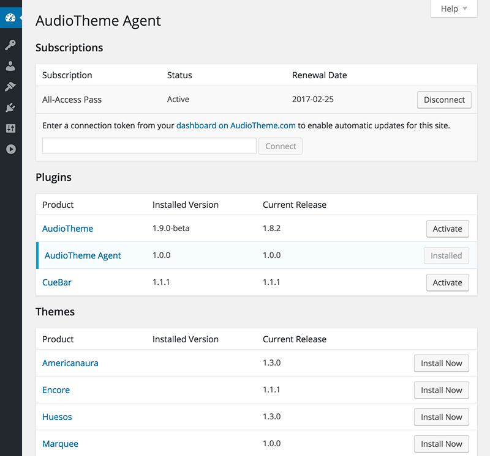

# AudioTheme Agent

The AudioTheme Agent connects WordPress sites to [AudioTheme.com](https://audiotheme.com/) to:

1. Install premium themes and and plugins directly from the admin panel
2. Deliver updates for installed premium themes and plugins
3. Help provide priority support
4. Interact with the AudioTheme.com REST API

## Documentation

Instructions for installing and using the agent can be found in the [AudioTheme Agent plugin guide](https://audiotheme.com/support/audiotheme-agent/).

  
_The AudioTheme Agent screen in the WordPress admin panel._
